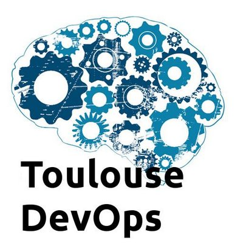

=======================================
Lancement du Toulouse DevOps User Group
=======================================

:date: 2014-10-30
:summary: Lancement du Toulouse DevOps User Group
:author: Lionel Porcheron

Nous lançons (enfin) le Toulouse DevOps User Group. La majorité des grandes villes Françaises (Paris, Lyon, Lille, Grenoble) disposent déjà d'un groupe d'échange autour des problématiques DevOps, il était donc normal de combler ce manque dans notre ville rose. 

Nous vous proposons donc de nous retrouver sur un groupe `meetup <http://www.meetup.com/Toulouse-DevOps/>`_ et sur twitter `@toulousedevops <https://twitter.com/toulousedevops>`_. Nous avons également un espace d'échange et de discussion via un `Google Group <https://groups.google.com/forum/#!forum/toulouse-devops>`_.

