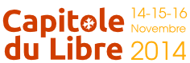

=================================================================
Première rencontre Toulouse Devops lors du Capitole du Libre 2014
=================================================================

:date: 2014-10-31
:summary: Première rencontre Toulouse Devops lors du Capitole du Libre 2014
:author: Lionel Porcheron

Nous organisons le premier meetup du groupe Toulouse DevOps dans le cadre de Capitole du Libre les samedi 15 et dimanche 16 novembre à l'ENSEEIHT en centre ville de Toulouse.

Une "track" dédiée au DevOps est organisée cette année. Le samedi sera consacré aux conférences: introduction à DevOps, Docker, outils de gestion de configuration, OpenStack seront les sujets abordés. `Le programme détaillé est en ligne sur le site de Capitole du Libre <http://2014.capitoledulibre.org/schedule/conferences/devops/list/>`_.

Le dimanche, nous mettons en place deux ateliers: l'un sur SaltStack (un outil de gestion de configuration) et l'autre sur Docker. `La description des ateliers est en ligne sur le site de Capitole du Libre <http://2014.capitoledulibre.org/schedule/ateliers/devops/list/>`_.
Les ateliers sont gratuis mais sur inscription (inscription sur le site de Capitole du Libre).

La journée du samedi sera conclue par un apéritif dinatoire commun à Capitole du Libre. N'hésitez pas à consulter `le programme de Capitole du Libre <http://2014.capitoledulibre.org/schedule/>`_, en plus des conférences DevOps, vous y trouverez de nombreuses conférences passionnantes !
                                                                                
Inscrivez-vous dès maintenant sur `l'événement meetup associé à l'événement <http://www.meetup.com/Toulouse-DevOps/events/216639062/>`_.

